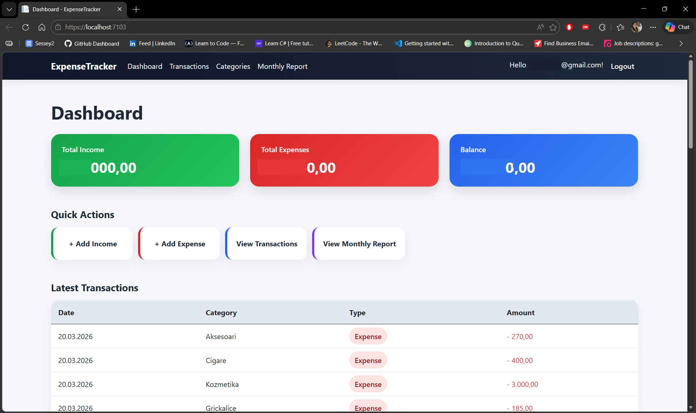
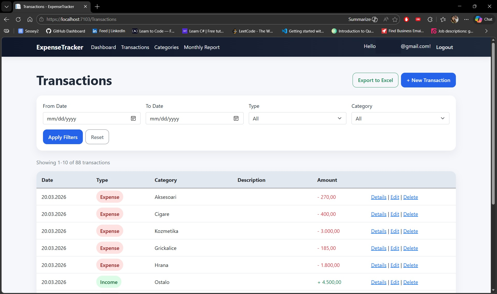
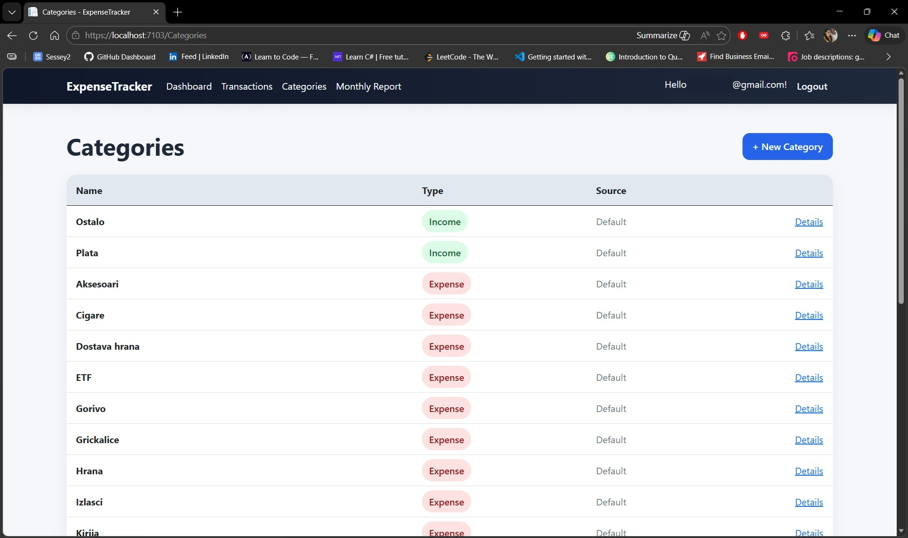

# 💰 Expense Tracker

> Personal finance tracking web application built with ASP.NET Core MVC
> Clean architecture, real-world use case, and full CRUD functionality.

---

## 🚀 Live Features

* 📥 Add income and expenses
* 📊 Dashboard overview (income / expense / balance)
* 🔎 Advanced filtering (date, category, type)
* 📄 Monthly reports
* 🗂️ Category management
* 🔐 User authentication & authorization
* 📤 Excel export

---

## 🧠 Tech Stack

| Layer    | Technology              |
| -------- | ----------------------- |
| Backend  | ASP.NET Core MVC        |
| ORM      | Entity Framework Core   |
| Database | SQL Server (LocalDB)    |
| Frontend | Razor Views + Bootstrap |
| Auth     | ASP.NET Identity        |

---

## 📸 Screenshots

### 📊Dashboard


### 💸Transactions


### 🗂️Categories


---

## 📊 Project Overview

This application allows users to track personal finances through a structured system of transactions and categories.

It demonstrates:

* Real-world CRUD operations
* Data filtering and pagination
* Separation of concerns (MVC pattern)
* Clean and scalable project structure
* Practical use of Entity Framework Core

---

## ⚙️ How to Run Locally

1. Clone the repository:

```bash
git clone https://github.com/Mirko95ks/expense-tracker.git
```

2. Open solution in Visual Studio

3. Apply migrations:

```bash
Update-Database
```

4. Run the application:

```bash
dotnet run
```

---

## 🎯 Purpose

This project was built as a **real-life utility application**, not just a demo.
It is actively used for tracking personal expenses and improving financial awareness.

---

## 👤 Author

**Mirko Stevanović**

* GitHub: https://github.com/Mirko95ks

---

## ⭐ Notes

* Project is under active development
* Future improvements: API layer, SPA frontend, deployment

---
